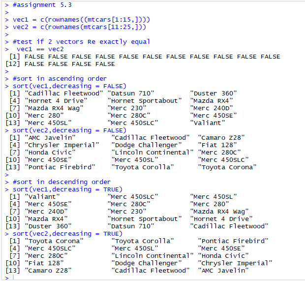

# Assignment-5.3
Assignments for Acadguild

1. Test whether two vectors are exactly equal (element by
element)

vec1 = c(rownames(mtcars[1:15,]))

vec2 = c(rownames(mtcars[11:25,]))

2. Sort the character vector in ascending order and descending
order

vec1 = c(rownames(mtcars[1:15,]))

vec2 = c(rownames(mtcars[11:25,]))

3.What is the major difference between str_c() and paste()
show an example.

str_c():
the default separator is an empty string.
combining any strings with a missing value will result in another missing value.

Paste():
the default separator is space.
turns missing values into the string "NA"

Introduce a separator when concatenating the strings

